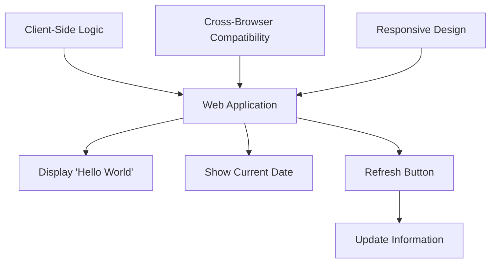
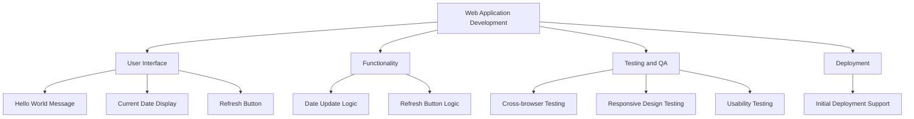
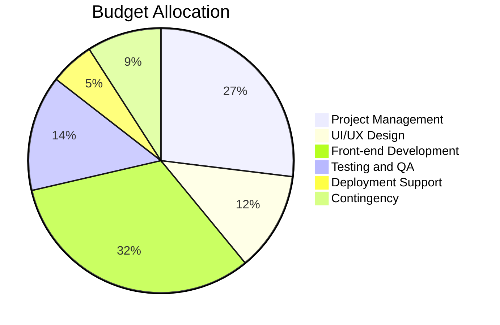
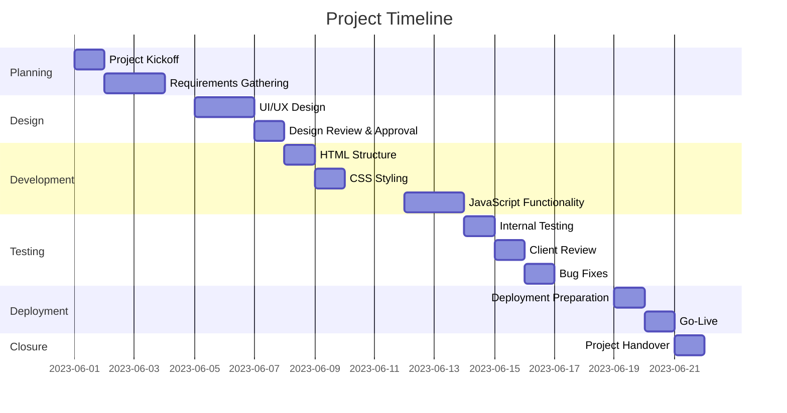
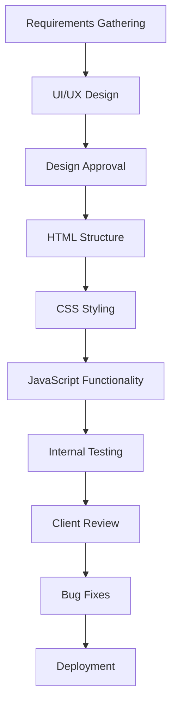
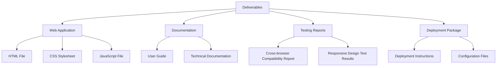

## EXECUTIVE SUMMARY

### PROJECT OVERVIEW

This project aims to develop a straightforward web application that displays a "Hello World" message along with the current date. The application will also feature a "Refresh" button, allowing users to update the displayed information. This solution addresses the client's need for a simple, functional web presence without the complexity of server-side logic.

### OBJECTIVES

1. Create a lightweight, client-side web application
2. Display "Hello World" message and current date
3. Implement a "Refresh" button for updating displayed information
4. Ensure cross-browser compatibility and responsiveness
5. Deliver a clean, intuitive user interface

### VALUE PROPOSITION

Our agency offers:

1. Rapid development and deployment of the requested web application
2. Expertise in creating efficient, client-side solutions
3. Focus on user experience and interface design
4. Scalable architecture allowing for future enhancements if needed
5. Thorough testing and quality assurance processes

## PROJECT OBJECTIVES

### BUSINESS GOALS

1. Establish a minimal online presence for the client
2. Demonstrate the client's ability to deliver a functional web application
3. Create a foundation for potential future web development projects
4. Enhance the client's credibility in the digital space

### TECHNICAL GOALS

1. Develop a lightweight, client-side web application using modern web technologies
2. Implement real-time date display functionality
3. Create a responsive design that works across various devices and screen sizes
4. Ensure cross-browser compatibility for major web browsers
5. Implement a "Refresh" button with client-side logic to update displayed information

### SUCCESS CRITERIA

| Criterion | Description | Target |
|-----------|-------------|--------|
| Functionality | All required features work as specified | 100% completion |
| Performance | Page load time | < 2 seconds |
| Compatibility | Works on major browsers (Chrome, Firefox, Safari, Edge) | 100% compatibility |
| Responsiveness | Displays correctly on desktop, tablet, and mobile devices | 100% responsiveness |
| User Satisfaction | Positive feedback from client | > 90% satisfaction |

```mermaid
graph TD
    A[Project Objectives]
    A --> B[Business Goals]
    A --> C[Technical Goals]
    A --> D[Success Criteria]
    
    B --> B1[Establish online presence]
    B --> B2[Demonstrate web capability]
    B --> B3[Foundation for future projects]
    B --> B4[Enhance digital credibility]
    
    C --> C1[Develop lightweight app]
    C --> C2[Implement date display]
    C --> C3[Create responsive design]
    C --> C4[Ensure cross-browser compatibility]
    C --> C5[Implement Refresh functionality]
    
    D --> D1[Functionality: 100% completion]
    D --> D2[Performance: <2s load time]
    D --> D3[Compatibility: 100% major browsers]
    D --> D4[Responsiveness: 100% devices]
    D --> D5[User Satisfaction: >90%]
```

## SCOPE OF WORK

### IN-SCOPE

1. Web Application Development
   - Create a single-page web application using HTML, CSS, and JavaScript
   - Implement responsive design for desktop, tablet, and mobile devices
   - Ensure cross-browser compatibility for major browsers (Chrome, Firefox, Safari, Edge)

2. User Interface
   - Display "Hello World" message prominently on the page
   - Show current date in a clear, readable format
   - Include a "Refresh" button with appropriate styling

3. Functionality
   - Implement client-side JavaScript to display and update the current date
   - Create functionality for the "Refresh" button to update the displayed date

4. Testing and Quality Assurance
   - Conduct thorough testing on various devices and browsers
   - Perform usability testing to ensure intuitive user experience

5. Deployment
   - Assist with initial deployment of the web application to a hosting platform

### OUT-OF-SCOPE

1. Server-side logic or backend development
2. Database integration or data storage
3. User authentication or login functionality
4. Additional pages or complex navigation
5. Integration with third-party APIs or services
6. Ongoing maintenance or updates after initial deployment
7. Content creation beyond the specified "Hello World" message
8. Search engine optimization (SEO) services
9. Performance optimization beyond initial implementation
10. Custom domain registration or SSL certificate procurement

### ASSUMPTIONS

1. The client will provide any specific design preferences or branding guidelines if required
2. The client has access to a web hosting service for deployment
3. The project will use standard web technologies (HTML, CSS, JavaScript) without the need for specialized frameworks
4. The client will be responsible for any costs associated with web hosting or domain registration
5. The current date will be based on the user's local system time
6. The project timeline assumes timely feedback and approvals from the client

### DEPENDENCIES

| Dependency | Description | Potential Impact |
|------------|-------------|-------------------|
| Web Hosting | Availability of a suitable web hosting platform | May affect deployment timeline |
| Client Feedback | Timely responses and approvals from the client | Could impact project timeline and final deliverables |
| Browser Compatibility | Consistent behavior across different web browsers | May require additional testing and adjustments |
| Device Availability | Access to various devices for responsive design testing | Could affect the thoroughness of cross-device testing |
| Internet Connectivity | Stable internet connection for development and testing | May impact development speed and communication |

## BUDGET AND COST ESTIMATES

### COST BREAKDOWN

| Item | Description | Quantity | Rate | Total |
|------|-------------|----------|------|-------|
| Project Management | Oversight, client communication, documentation | 4 hours | $100/hour | $400 |
| UI/UX Design | Simple layout and button design | 2 hours | $90/hour | $180 |
| Front-end Development | HTML, CSS, and JavaScript implementation | 6 hours | $80/hour | $480 |
| Testing and QA | Cross-browser and responsive design testing | 3 hours | $70/hour | $210 |
| Deployment Support | Assistance with initial deployment | 1 hour | $80/hour | $80 |
| Contingency | Buffer for unforeseen issues (10% of total) | - | - | $135 |
| **Total** | | | | **$1,485** |

### PAYMENT SCHEDULE

| Milestone | Deliverable | Payment Percentage | Amount |
|-----------|-------------|---------------------|--------|
| Project Kickoff | Signed agreement and initial requirements | 25% | $371.25 |
| Design Approval | Approved UI/UX design | 25% | $371.25 |
| Development Completion | Functional web application ready for testing | 25% | $371.25 |
| Project Delivery | Deployed application and project closure | 25% | $371.25 |
| **Total** | | **100%** | **$1,485** |

### BUDGET CONSIDERATIONS

1. Scope Creep: 
   - Risk: Client requests additional features or changes beyond the initial requirements.
   - Mitigation: Clearly define project scope in the contract. Any changes will be subject to change orders and additional costs.

2. Browser Compatibility Issues:
   - Risk: Unexpected compatibility issues with certain browsers may require additional development time.
   - Mitigation: The contingency budget can cover minor adjustments. Major issues may require a change order.

3. Client Delays:
   - Risk: Delayed feedback or approvals from the client could extend the project timeline.
   - Mitigation: Include a clause in the contract specifying that delays caused by the client may result in additional charges.

4. Technology Changes:
   - Risk: Rapid changes in web technologies could affect development or compatibility.
   - Mitigation: The project uses standard, stable web technologies, minimizing this risk.

5. Testing Complexity:
   - Risk: More extensive testing required due to diverse user devices and browsers.
   - Mitigation: The testing budget includes a buffer for additional time if needed.

This budget is based on the current project scope and requirements. Any significant changes or additions to the project scope may require a reassessment of the budget and timeline. The contingency fund is included to handle minor unexpected issues or small scope adjustments without requiring immediate budget revisions.

## TIMELINE AND MILESTONES

### PROJECT TIMELINE

### KEY MILESTONES

| Milestone | Description | Target Date |
|-----------|-------------|-------------|
| M1: Project Kickoff | Initial meeting, project scope finalization | 2023-06-01 |
| M2: Design Approval | Client approval of UI/UX design | 2023-06-07 |
| M3: Development Complete | Functional web application ready for testing | 2023-06-13 |
| M4: Testing Complete | All tests passed, application ready for deployment | 2023-06-16 |
| M5: Go-Live | Application deployed and accessible to users | 2023-06-20 |
| M6: Project Closure | Final handover and documentation complete | 2023-06-21 |

### CRITICAL PATH

The critical path for this project consists of the following key activities:

1. Requirements Gathering
2. UI/UX Design
3. Design Approval
4. HTML Structure Development
5. CSS Styling
6. JavaScript Functionality Implementation
7. Internal Testing
8. Client Review
9. Bug Fixes
10. Deployment

These activities are crucial for maintaining the project schedule. Any delays in these tasks could potentially impact the overall project timeline. To mitigate risks:

1. Ensure clear communication with the client during requirements gathering and design approval stages.
2. Allocate adequate time for development and testing phases.
3. Schedule regular check-ins to address any issues promptly.
4. Maintain a small buffer in the timeline for unexpected challenges.

By focusing on these critical path activities and maintaining open communication with the client, we can ensure the project stays on track and meets its targeted completion date.

## DELIVERABLES

### LIST OF DELIVERABLES

1. Web Application
   - Single HTML file
   - CSS stylesheet
   - JavaScript file
2. Documentation
   - User Guide
   - Technical Documentation
3. Testing Reports
   - Cross-browser Compatibility Report
   - Responsive Design Test Results
4. Deployment Package
   - Deployment Instructions
   - Configuration Files (if any)

### DELIVERY SCHEDULE

| Deliverable | Expected Delivery Date |
|-------------|------------------------|
| Web Application (HTML, CSS, JS) | 2023-06-13 |
| User Guide | 2023-06-15 |
| Technical Documentation | 2023-06-16 |
| Testing Reports | 2023-06-16 |
| Deployment Package | 2023-06-19 |

### ACCEPTANCE CRITERIA

1. Web Application
   - Displays "Hello World" message prominently
   - Shows current date accurately
   - Includes a functional "Refresh" button
   - Responsive design works on desktop, tablet, and mobile devices
   - Compatible with latest versions of Chrome, Firefox, Safari, and Edge

2. Documentation
   - User Guide:
     - Clear instructions on how to use the application
     - Screenshots of the application interface
   - Technical Documentation:
     - Detailed explanation of code structure
     - Instructions for future maintenance or updates

3. Testing Reports
   - Cross-browser Compatibility Report:
     - Confirmation of functionality in specified browsers
     - Screenshots of application in each browser
   - Responsive Design Test Results:
     - Confirmation of proper display on various screen sizes
     - Screenshots of application on desktop, tablet, and mobile views

4. Deployment Package
   - Deployment Instructions:
     - Step-by-step guide for deploying the application
     - List of any required server configurations
   - Configuration Files:
     - Any necessary configuration files for deployment

| Deliverable | Acceptance Criteria |
|-------------|---------------------|
| Web Application | - Displays "Hello World" and current date - "Refresh" button updates date - Responsive on all devices - Compatible with specified browsers |
| User Guide | - Clear usage instructions - Includes interface screenshots |
| Technical Documentation | - Explains code structure - Provides maintenance instructions |
| Testing Reports | - Confirms cross-browser compatibility - Verifies responsive design |
| Deployment Package | - Contains clear deployment instructions - Includes all necessary configuration files |

The client will review each deliverable against these criteria. Acceptance will be confirmed in writing within 3 business days of delivery. Any issues or discrepancies will be addressed promptly to ensure all deliverables meet the specified criteria.