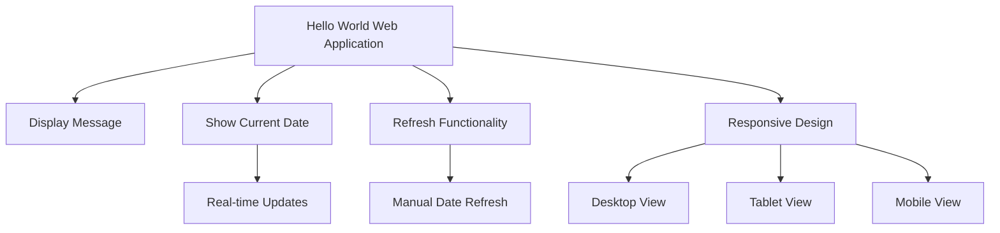
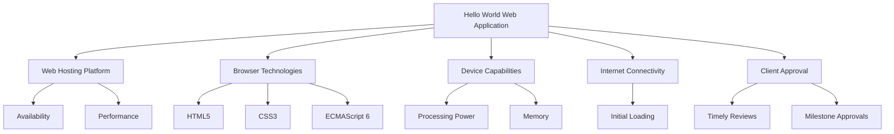
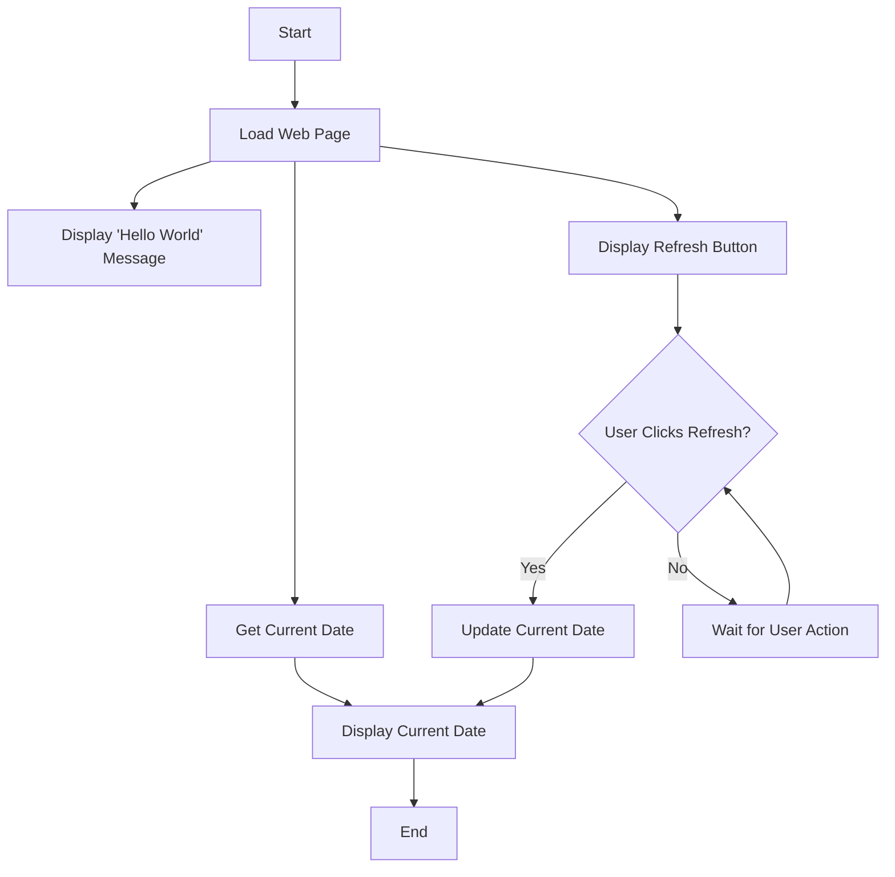
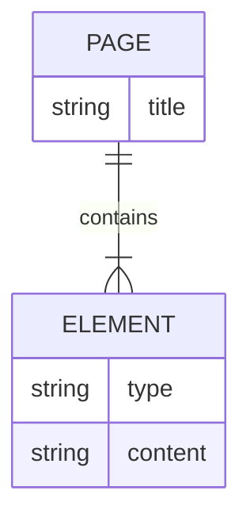
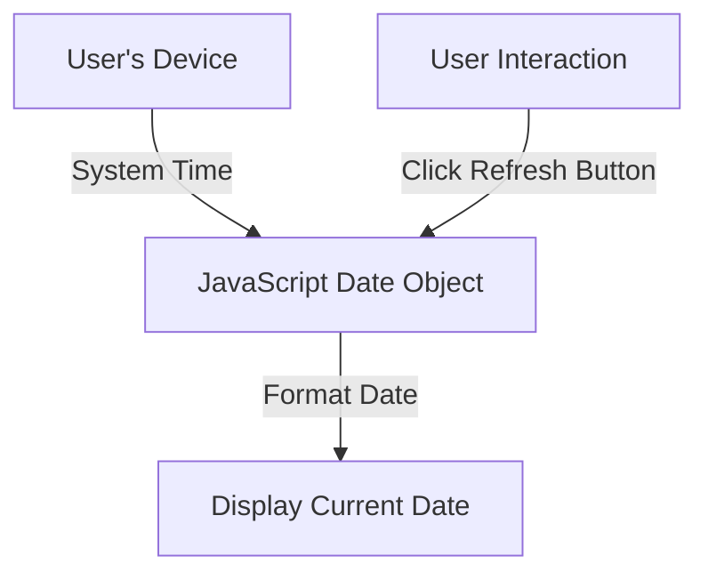
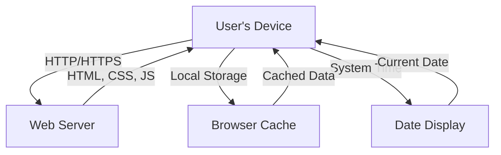

## INTRODUCTION

### PURPOSE

The purpose of this Software Requirements Specification (SRS) document is to provide a comprehensive description of the "Hello World" web application. It outlines the functional and non-functional requirements, constraints, and specifications necessary for the development and implementation of the application. This document serves as a guide for developers, designers, testers, and project managers involved in the creation of the web application. Additionally, it acts as a reference point for the client to ensure that the final product aligns with their expectations and requirements.

### SCOPE

The "Hello World" web application is a lightweight, client-side solution designed to establish a minimal online presence for the client. The scope of this project encompasses the following:

1. Core Functionalities:
   - Display a "Hello World" message prominently on a single web page
   - Show the current date, updated in real-time
   - Provide a "Refresh" button to manually update the displayed information

2. Technical Implementation:
   - Develop using standard web technologies: HTML, CSS, and JavaScript
   - Create a responsive design that adapts to desktop, tablet, and mobile devices
   - Ensure cross-browser compatibility with major browsers (Chrome, Firefox, Safari, Edge)

3. User Interface:
   - Design a clean, intuitive interface focusing on simplicity and ease of use
   - Implement a visually appealing layout that aligns with modern web design principles

4. Performance:
   - Optimize for fast loading times (target: < 2 seconds)
   - Implement efficient client-side logic for date updates and refresh functionality

5. Deployment:
   - Prepare the application for easy deployment on standard web hosting platforms

The primary goals of this web application are to:
- Demonstrate the client's capability to deliver a functional web presence
- Provide a foundation for potential future web development projects
- Enhance the client's credibility in the digital space

Benefits of the application include:
- Rapid development and deployment
- Low maintenance requirements due to client-side only logic
- Scalability for future enhancements if needed
- Cross-device accessibility, ensuring a wide reach for potential users

This SRS document will guide the development process, ensuring that all stakeholders have a clear understanding of the project's requirements and objectives. It will serve as the primary reference for design, development, testing, and acceptance of the final web application.

## PRODUCT DESCRIPTION

### PRODUCT PERSPECTIVE

The "Hello World" web application is a standalone, client-side solution designed to provide a minimal online presence. It operates independently without relying on server-side logic or external systems. The application fits into the broader context of web-based solutions, serving as an entry-level demonstration of web development capabilities. While simple in nature, it adheres to modern web standards and best practices, ensuring compatibility with various web browsers and devices.

### PRODUCT FUNCTIONS

The "Hello World" web application performs the following main functions:

1. Display Message: Prominently shows a "Hello World" message on the web page.
2. Show Current Date: Displays the current date, updated in real-time.
3. Refresh Functionality: Provides a "Refresh" button that allows users to manually update the displayed information.
4. Responsive Design: Adapts the layout and content presentation based on the user's device screen size.



### USER CHARACTERISTICS

The intended users of the "Hello World" web application include:

1. General Public: Individuals with basic internet browsing skills who may stumble upon the website.
2. Potential Clients: Business professionals or decision-makers evaluating the client's web development capabilities.
3. Developers: Technical users who may be interested in the implementation of a simple web application.

User Personas:

1. Sarah, 35, Marketing Manager
   - Moderate technical skills
   - Primarily uses a laptop for work
   - Interested in assessing the client's ability to create web solutions

2. Alex, 22, Computer Science Student
   - High technical proficiency
   - Uses various devices (desktop, tablet, smartphone)
   - Curious about the implementation of basic web applications

3. John, 50, Small Business Owner
   - Limited technical expertise
   - Mainly uses a tablet for browsing
   - Looking for a web development partner for his business

### CONSTRAINTS

1. Technical Constraints:
   - Must use only client-side technologies (HTML, CSS, JavaScript)
   - No server-side logic or database integration allowed
   - Must be compatible with major browsers (Chrome, Firefox, Safari, Edge)
   - Should function without an internet connection after initial load

2. Design Constraints:
   - Limited to a single-page application
   - Must maintain a clean, minimalist design
   - Should be fully responsive across desktop, tablet, and mobile devices

3. Performance Constraints:
   - Page load time should not exceed 2 seconds on standard broadband connections
   - All functionality must work smoothly on devices up to 5 years old

4. Regulatory Constraints:
   - Must comply with WCAG 2.1 Level AA accessibility guidelines
   - Should adhere to GDPR requirements, even though no user data is collected

5. Budgetary Constraints:
   - Development must be completed within the allocated budget of $1,485
   - No paid third-party libraries or services can be used

### ASSUMPTIONS AND DEPENDENCIES

Assumptions:

1. Users have access to a device with a modern web browser (not older than 2 years).
2. The client has secured a domain name and web hosting service for deployment.
3. Users' devices have accurate system clocks for displaying the current date.
4. The application will be used in various time zones without issues.
5. The client will provide timely feedback during the development process.

Dependencies:

1. Web Hosting Platform: The application depends on the availability and performance of the chosen web hosting service.
2. Browser Technologies: Relies on consistent implementation of HTML5, CSS3, and ECMAScript 6 features across major browsers.
3. Device Capabilities: Depends on users' devices having sufficient processing power and memory to run client-side JavaScript.
4. Internet Connectivity: Initial loading of the application requires a working internet connection.
5. Client Approval: Timely reviews and approvals from the client are necessary to meet project milestones.



These assumptions and dependencies are critical for the successful development and deployment of the "Hello World" web application. Regular assessment and communication with the client regarding these factors will help mitigate potential risks and ensure smooth project execution.

Here's the PROCESS FLOWCHART section for the "Hello World" web application using Mermaid JS, maintaining consistency with the previously established technology and framework choices:

## PROCESS FLOWCHART

The following flowchart illustrates the main processes and user interactions within the "Hello World" web application:



The process flow of the application is as follows:

1. The web page loads in the user's browser.
2. The "Hello World" message is displayed prominently on the page.
3. The application retrieves the current date from the user's device.
4. The current date is displayed on the page.
5. A "Refresh" button is shown on the page.
6. The application waits for user interaction.
7. If the user clicks the "Refresh" button:
   - The current date is updated.
   - The display is refreshed with the new date.
8. If the user doesn't click the "Refresh" button, the application continues to wait for user action.

This simple flow ensures that the application meets its core requirements of displaying the "Hello World" message, showing the current date, and providing a refresh functionality, all while maintaining a lightweight, client-side only implementation using HTML, CSS, and JavaScript.

Based on the previously established requirements and technology choices for the "Hello World" web application, here's a breakdown of the product features with the requested sub-sections:

### Feature 1: Hello World Display

#### ID
F001

#### DESCRIPTION
Display a "Hello World" message prominently on the web page.

#### PRIORITY
High

#### TABLE OF FUNCTIONAL REQUIREMENTS

| ID | Requirement | Description |
|----|-------------|-------------|
| F001-1 | Message Content | The text "Hello World" must be displayed |
| F001-2 | Prominence | The message should be the most noticeable element on the page |
| F001-3 | Responsiveness | The message must be clearly visible on all device sizes |

### Feature 2: Current Date Display

#### ID
F002

#### DESCRIPTION
Show the current date, updated in real-time.

#### PRIORITY
High

#### TABLE OF FUNCTIONAL REQUIREMENTS

| ID | Requirement | Description |
|----|-------------|-------------|
| F002-1 | Date Accuracy | Display the current date based on the user's local system time |
| F002-2 | Date Format | Present the date in a clear, readable format (e.g., "June 1, 2023") |
| F002-3 | Real-time Updates | Update the date automatically without page reload |
| F002-4 | Responsiveness | Ensure the date is clearly visible on all device sizes |

### Feature 3: Refresh Button

#### ID
F003

#### DESCRIPTION
Provide a "Refresh" button that allows users to manually update the displayed information.

#### PRIORITY
Medium

#### TABLE OF FUNCTIONAL REQUIREMENTS

| ID | Requirement | Description |
|----|-------------|-------------|
| F003-1 | Button Presence | Display a clearly labeled "Refresh" button on the page |
| F003-2 | Button Functionality | Update the current date when the button is clicked |
| F003-3 | Visual Feedback | Provide visual feedback when the button is pressed |
| F003-4 | Responsiveness | Ensure the button is easily clickable on all device sizes |

### Feature 4: Responsive Design

#### ID
F004

#### DESCRIPTION
Implement a responsive design that adapts to desktop, tablet, and mobile devices.

#### PRIORITY
High

#### TABLE OF FUNCTIONAL REQUIREMENTS

| ID | Requirement | Description |
|----|-------------|-------------|
| F004-1 | Desktop Layout | Optimize layout for desktop screens (>= 1024px width) |
| F004-2 | Tablet Layout | Adapt layout for tablet screens (768px - 1023px width) |
| F004-3 | Mobile Layout | Optimize layout for mobile screens (< 768px width) |
| F004-4 | Fluid Typography | Implement responsive font sizes across all device sizes |
| F004-5 | Touch-friendly | Ensure all interactive elements are touch-friendly on mobile devices |

### Feature 5: Cross-Browser Compatibility

#### ID
F005

#### DESCRIPTION
Ensure the application works consistently across major web browsers.

#### PRIORITY
High

#### TABLE OF FUNCTIONAL REQUIREMENTS

| ID | Requirement | Description |
|----|-------------|-------------|
| F005-1 | Chrome Compatibility | Ensure full functionality in the latest version of Google Chrome |
| F005-2 | Firefox Compatibility | Ensure full functionality in the latest version of Mozilla Firefox |
| F005-3 | Safari Compatibility | Ensure full functionality in the latest version of Apple Safari |
| F005-4 | Edge Compatibility | Ensure full functionality in the latest version of Microsoft Edge |
| F005-5 | Graceful Degradation | Provide basic functionality in older browser versions |

These features and their functional requirements align with the previously established technology choices, focusing on a client-side implementation using HTML, CSS, and JavaScript. They cover the core functionality of displaying the "Hello World" message and current date, providing a refresh option, ensuring responsive design, and maintaining cross-browser compatibility.

## NON-FUNCTIONAL REQUIREMENTS

### PERFORMANCE

1. Page Load Time:
   - The web application must load completely within 2 seconds on a standard broadband connection (10 Mbps or higher).
   - The initial "Hello World" message and current date should be visible within 1 second of page load.

2. Refresh Response Time:
   - The "Refresh" button must update the current date within 100 milliseconds of being clicked.

3. Resource Usage:
   - The total size of all assets (HTML, CSS, JavaScript) must not exceed 100 KB uncompressed.
   - The application should consume no more than 50 MB of device memory during runtime.

4. Concurrent Users:
   - The application should support up to 1000 concurrent users without degradation in performance.

### SAFETY

1. Data Integrity:
   - The application must ensure that the displayed date is always accurate and cannot be manipulated by users.

2. Error Handling:
   - In case of any JavaScript errors, the application should gracefully degrade to display static content without crashing the browser tab.

3. Browser Compatibility:
   - If the application detects an unsupported browser, it should display a warning message to the user recommending supported browsers.

4. Offline Functionality:
   - The application should cache necessary resources to function offline after initial load, displaying the last known date if unable to update.

### SECURITY

1. Data Protection:
   - No user data is collected, stored, or transmitted by the application.

2. Content Security Policy:
   - Implement a strict Content Security Policy to prevent XSS attacks and unauthorized resource loading.

3. HTTPS:
   - The application must be served over HTTPS to ensure data integrity and prevent man-in-the-middle attacks.

4. Input Validation:
   - Although user input is minimal, any interaction with the "Refresh" button should be validated to prevent potential security vulnerabilities.

### QUALITY

1. Availability:
   - The web application should have an uptime of 99.9%, excluding scheduled maintenance periods.

2. Maintainability:
   - The codebase must be well-documented with inline comments.
   - Follow consistent coding standards (e.g., ESLint for JavaScript) to ensure code readability and maintainability.

3. Usability:
   - The user interface must be intuitive, requiring no instructions for users to understand how to use the "Refresh" button.
   - The application should have a Usability System Scale (SUS) score of at least 80 out of 100.

4. Scalability:
   - The application architecture should allow for easy addition of new features or content in the future without requiring a complete redesign.

5. Reliability:
   - The application should function consistently across all supported browsers and devices with a 99.99% success rate for displaying the correct date and time.

### COMPLIANCE

1. Web Standards:
   - The application must comply with W3C standards for HTML5, CSS3, and ECMAScript 6.

2. Accessibility:
   - The web application must conform to WCAG 2.1 Level AA standards to ensure accessibility for users with disabilities.

3. Data Protection:
   - Although no personal data is collected, the application should still comply with GDPR principles of data minimization and purpose limitation.

4. Browser Support:
   - The application must support the latest versions of Chrome, Firefox, Safari, and Edge, as well as the previous two major versions of each.

5. Responsive Design:
   - The application must adhere to responsive web design principles, functioning on devices with screen widths from 320px to 4K resolution.

```mermaid
graph TD
    A[Non-Functional Requirements]
    A --> B[Performance]
    A --> C[Safety]
    A --> D[Security]
    A --> E[Quality]
    A --> F[Compliance]
    
    B --> B1[Page Load Time]
    B --> B2[Refresh Response Time]
    B --> B3[Resource Usage]
    B --> B4[Concurrent Users]
    
    C --> C1[Data Integrity]
    C --> C2[Error Handling]
    C --> C3[Browser Compatibility]
    C --> C4[Offline Functionality]
    
    D --> D1[Data Protection]
    D --> D2[Content Security Policy]
    D --> D3[HTTPS]
    D --> D4[Input Validation]
    
    E --> E1[Availability]
    E --> E2[Maintainability]
    E --> E3[Usability]
    E --> E4[Scalability]
    E --> E5[Reliability]
    
    F --> F1[Web Standards]
    F --> F2[Accessibility]
    F --> F3[Data Protection]
    F --> F4[Browser Support]
    F --> F5[Responsive Design]
```



These non-functional requirements ensure that the "Hello World" web application not only meets its functional goals but also adheres to high standards of performance, safety, security, quality, and compliance. They are consistent with the previously established technology choices of HTML, CSS, and JavaScript for client-side implementation, and take into account the simplicity and lightweight nature of the application while still maintaining professional standards.

## DATA REQUIREMENTS

Given the simplicity of the "Hello World" web application, which is entirely client-side and does not involve server-side data storage or processing, the data requirements are minimal. However, we will outline the relevant aspects to maintain consistency with the document structure and provide a foundation for potential future enhancements.

### DATA MODELS

The application does not require a complex data model as it only deals with displaying a static message and the current date. However, for clarity, we can represent the basic structure of the data displayed on the page:



In this simple model:
- The PAGE represents the single web page of the application.
- ELEMENT represents the individual components on the page (Hello World message, current date, and refresh button).
- Each ELEMENT has a type (e.g., "message", "date", "button") and content.

### DATA STORAGE

As this is a client-side only application, there is no persistent data storage on the server. However, we can consider the following aspects:

1. Local Storage:
   - The application may use browser local storage to cache the last known date in case of offline usage.
   - Retention: Until the user clears their browser data or the application explicitly removes it.

2. Redundancy:
   - Not applicable for server-side storage as there is none.

3. Backup:
   - Not applicable for server-side data.

4. Recovery:
   - In case of local storage failure, the application will simply recalculate the current date using the device's system time.

### DATA PROCESSING

The data processing in this application is minimal and occurs entirely on the client-side. Here's an overview of the data flow:



Data Security:
1. Input Validation:
   - Ensure that the "Refresh" button click event is properly handled to prevent any potential security vulnerabilities.

2. Cross-Site Scripting (XSS) Prevention:
   - Use proper encoding when displaying the date to prevent any potential XSS attacks, even though the date is generated client-side.

3. Content Security Policy:
   - Implement a strict Content Security Policy to prevent unauthorized script execution and resource loading.

4. HTTPS:
   - Serve the application over HTTPS to ensure data integrity during transit, even though no sensitive data is being transmitted.

5. Data Minimization:
   - The application only processes the necessary data (current date) to fulfill its function, adhering to data minimization principles.

6. Client-Side Security:
   - Implement measures to prevent tampering with the client-side JavaScript that generates and displays the date.

Given the nature of this simple, client-side application, the data requirements are straightforward. The application does not store or process any user data, focusing solely on displaying the current date based on the user's device time. This approach ensures minimal data handling, reducing potential security and privacy concerns while still meeting the core requirements of the "Hello World" web application.

## EXTERNAL INTERFACES

### USER INTERFACES

The "Hello World" web application will have a simple, intuitive user interface designed to be accessible across various devices and screen sizes. The interface will consist of the following elements:

1. Header: Displaying the "Hello World" message prominently.
2. Date Display: Showing the current date in a clear, readable format.
3. Refresh Button: A clickable button labeled "Refresh" to update the displayed date.

The user interface will adhere to the following requirements:

1. Responsive Design: The layout will adapt seamlessly to desktop, tablet, and mobile screen sizes.
2. Accessibility: The interface will comply with WCAG 2.1 Level AA standards.
3. Minimalist Design: A clean, uncluttered layout focusing on the core elements.
4. Consistent Styling: Use of a cohesive color scheme and typography throughout the application.

Placeholder for UI Mockups:

```
[Desktop View Mockup]
+----------------------------------+
|           Hello World            |
|                                  |
|        Current Date: [Date]      |
|                                  |
|          [Refresh Button]        |
+----------------------------------+

[Mobile View Mockup]
+------------------+
|    Hello World   |
|                  |
|  Current Date:   |
|      [Date]      |
|                  |
| [Refresh Button] |
+------------------+
```

### SOFTWARE INTERFACES

As a client-side only web application, the "Hello World" application does not directly interface with external software systems. However, it does interact with the following software components:

1. Web Browsers:
   - The application will be compatible with the latest versions of Chrome, Firefox, Safari, and Edge.
   - It will utilize standard web APIs provided by these browsers, including:
     - DOM manipulation for updating the displayed date
     - Event handling for the Refresh button
     - Date object for retrieving and formatting the current date

2. JavaScript Runtime:
   - The application will run on the JavaScript engine provided by the user's web browser.
   - It will use ECMAScript 6 (ES6) features for enhanced functionality and code readability.

3. CSS Rendering Engine:
   - The application will rely on the browser's CSS rendering engine to apply styles and ensure responsive design.
   - It will use CSS3 features for layout and styling, including flexbox or grid for responsive layouts.

4. HTML5 Parser:
   - The application will utilize HTML5 semantic elements for improved structure and accessibility.

### COMMUNICATION INTERFACES

While the "Hello World" web application is primarily a static, client-side application, it does involve some communication interfaces:

1. HTTP/HTTPS Protocol:
   - The application will be served to users over HTTP/HTTPS.
   - Requirement: Support for HTTP/1.1 and HTTP/2 protocols.
   - Data Format: HTML, CSS, and JavaScript files.

2. Browser Cache:
   - The application may utilize browser caching to improve load times on subsequent visits.
   - Requirement: Proper cache headers to be set for static assets.

3. Local Storage:
   - The application may use browser local storage to cache the last known date for offline functionality.
   - Data Format: JSON string containing the date information.
   - Interaction Method: JavaScript Web Storage API.

4. System Time:
   - The application will interact with the user's system time to display the current date.
   - Interaction Method: JavaScript Date object.



These interfaces ensure that the "Hello World" web application can be served efficiently, function across various browsers and devices, and provide accurate date information to users. The simplicity of these interfaces aligns with the lightweight, client-side nature of the application while still maintaining professional standards and allowing for potential future enhancements.

## APPENDICES

### GLOSSARY

1. Client-side: Refers to operations that are performed by the client's web browser, rather than on a remote server.

2. Cross-browser compatibility: The ability of a website or web application to function correctly across different web browsers.

3. Responsive design: A web design approach that creates dynamic changes to the appearance of a website, depending on the screen size and orientation of the device being used to view it.

4. Single-page application (SPA): A web application or website that interacts with the user by dynamically rewriting the current page rather than loading entire new pages from the server.

5. Web API: A set of protocols and tools for building software applications, specifically those that interact with web browsers.

6. ECMAScript 6 (ES6): The 6th major version of the ECMAScript language specification, which is the standardized version of JavaScript.

7. DOM: Document Object Model, a programming interface for HTML and XML documents that represents the structure of a document as a tree-like hierarchy.

8. Flexbox: A CSS3 web layout model that allows responsive elements within a container to be automatically arranged depending on screen size.

9. Grid: A two-dimensional layout system in CSS that allows for complex layouts to be created with ease.

### ACRONYMS

1. HTML: HyperText Markup Language
2. CSS: Cascading Style Sheets
3. JS: JavaScript
4. SRS: Software Requirements Specification
5. UI: User Interface
6. UX: User Experience
7. API: Application Programming Interface
8. WCAG: Web Content Accessibility Guidelines
9. GDPR: General Data Protection Regulation
10. XSS: Cross-Site Scripting
11. HTTP: Hypertext Transfer Protocol
12. HTTPS: Hypertext Transfer Protocol Secure
13. SPA: Single Page Application
14. W3C: World Wide Web Consortium
15. SEO: Search Engine Optimization
16. QA: Quality Assurance

### ADDITIONAL REFERENCES

1. MDN Web Docs: A comprehensive resource for web technologies
   https://developer.mozilla.org/

2. W3C Web Design and Applications Standards
   https://www.w3.org/standards/webdesign/

3. WCAG 2.1 Guidelines
   https://www.w3.org/TR/WCAG21/

4. ECMAScript 6 Specification
   https://www.ecma-international.org/ecma-262/6.0/

5. Google Web Fundamentals
   https://developers.google.com/web/fundamentals

6. CSS-Tricks: A website dedicated to teaching all things web design and development
   https://css-tricks.com/

7. Can I use: Browser support tables for modern web technologies
   https://caniuse.com/

8. Web.dev: Guidance for modern web development
   https://web.dev/

9. A List Apart: Articles on web design, development, and best practices
   https://alistapart.com/

10. Smashing Magazine: Articles and resources for web designers and developers
    https://www.smashingmagazine.com/

These additional references provide valuable resources for understanding web technologies, best practices, and standards relevant to the development of the "Hello World" web application. They can serve as helpful guides for both the development team and the client in understanding various aspects of the project.