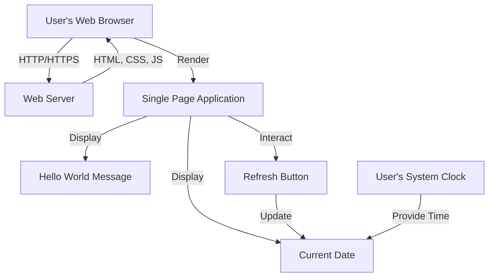
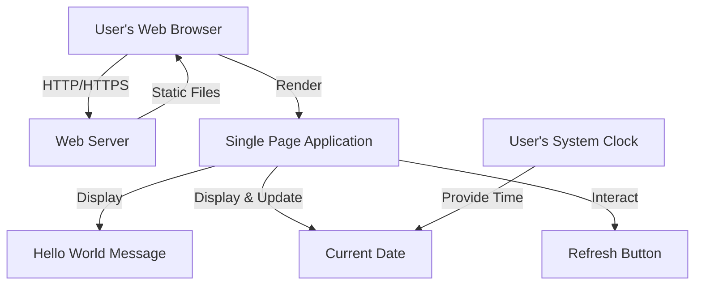
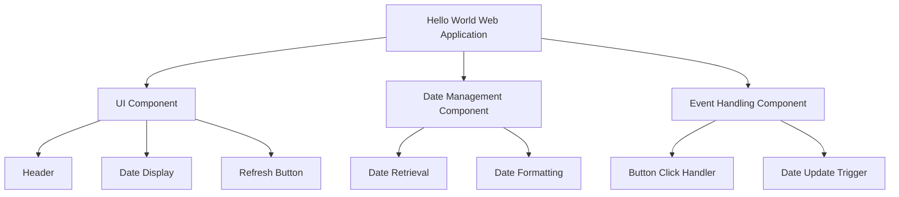
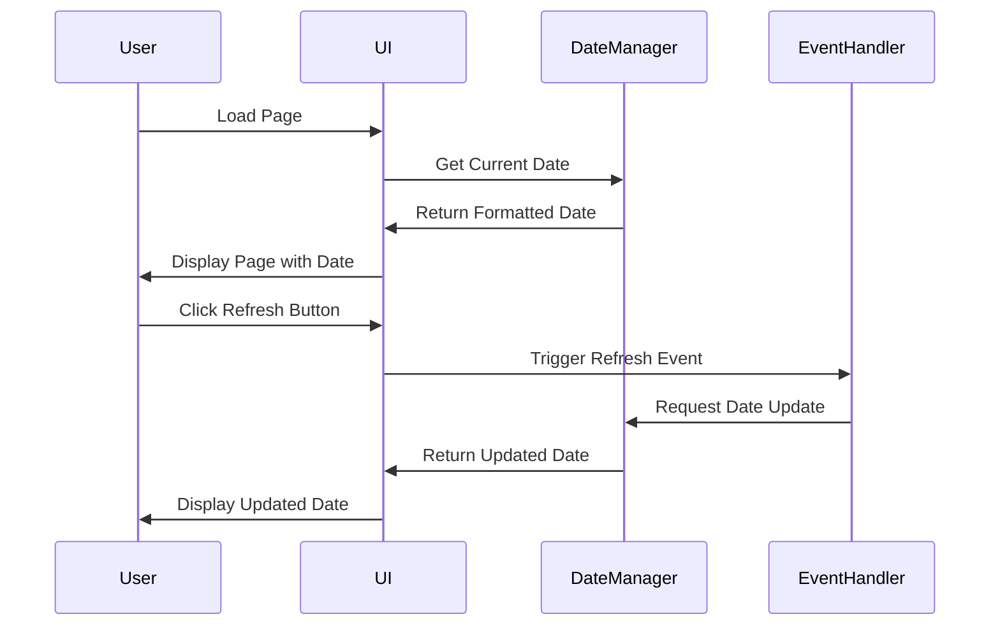
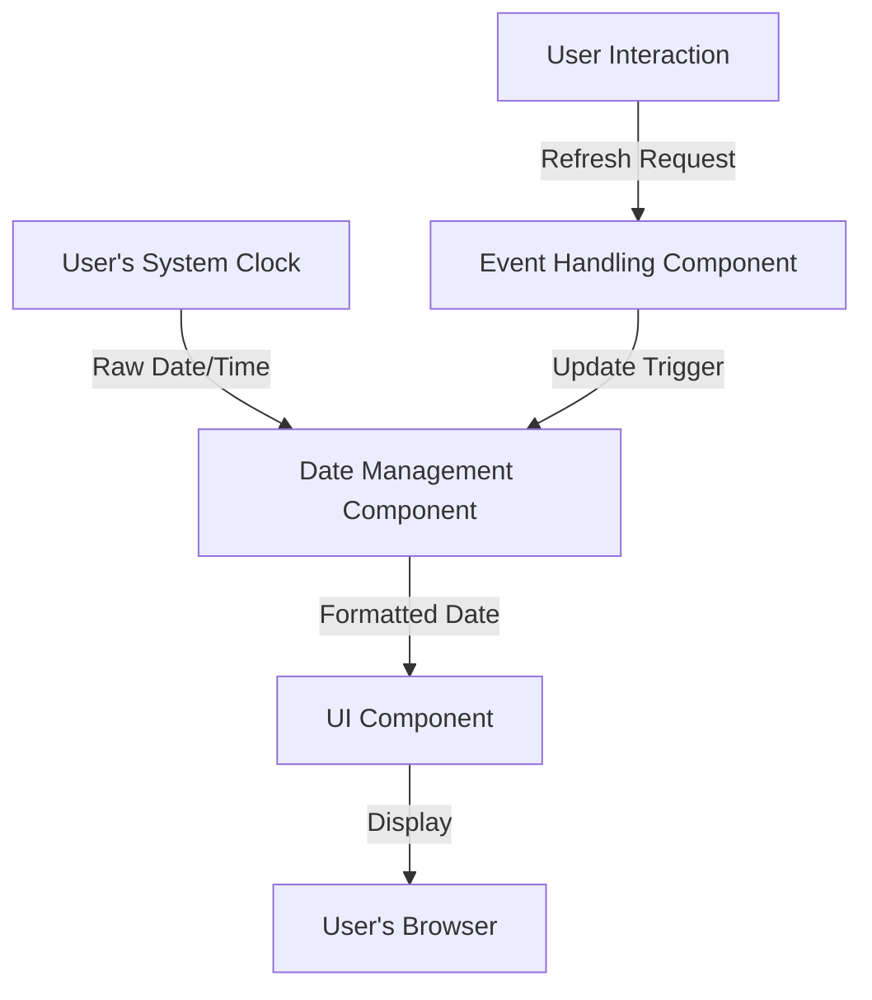
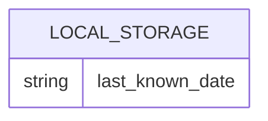
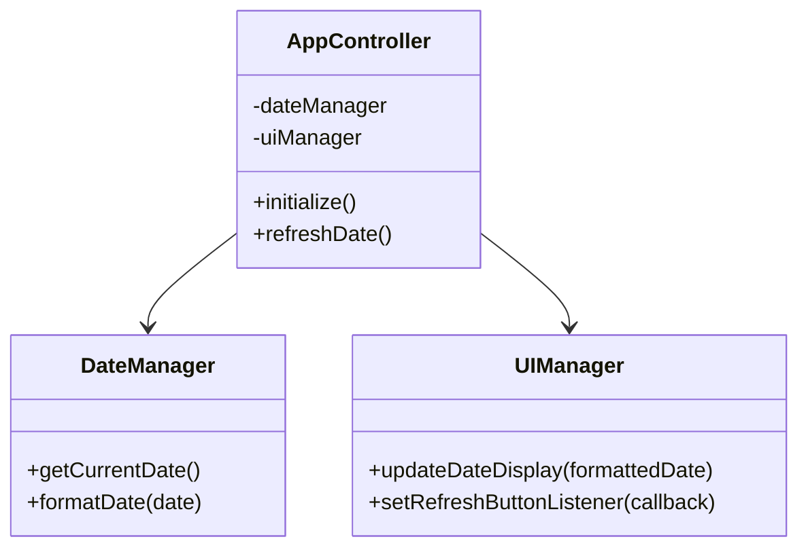
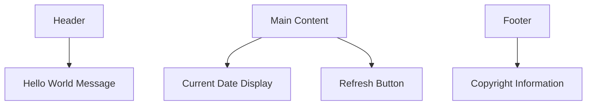
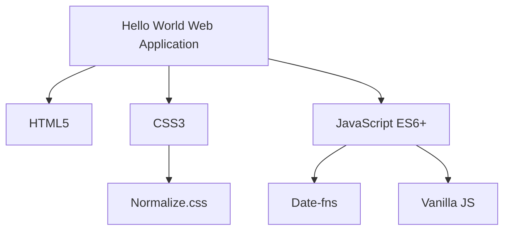
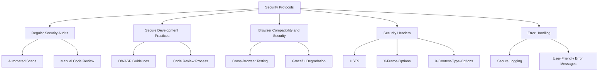

## INTRODUCTION

### SYSTEM OVERVIEW

The "Hello World" web application is a lightweight, client-side solution designed to provide a simple yet functional web presence. This system serves as a demonstration of basic web development capabilities while adhering to modern web standards and best practices. The application consists of a single web page that displays a "Hello World" message, shows the current date, and offers a refresh button for updating the displayed information.

Key components of the system include:

1. Front-end Interface:
   - A responsive, single-page design that adapts to various screen sizes
   - Displays "Hello World" message and current date
   - Includes a refresh button for user interaction

2. Client-side Logic:
   - JavaScript code to handle date retrieval and formatting
   - Event handling for the refresh button
   - Dynamic DOM manipulation for updating displayed information

3. Styling and Layout:
   - CSS3 for responsive design and visual presentation
   - Utilizes modern layout techniques (Flexbox or Grid)

4. Web Standards Compliance:
   - HTML5 for structure and semantics
   - WCAG 2.1 Level AA compliance for accessibility

5. Performance Optimization:
   - Minimized asset sizes for fast loading
   - Browser caching for improved subsequent visits

Here's a high-level overview of the system architecture:



The system operates entirely on the client-side, with no server-side processing required after the initial page load. This architecture ensures:

1. Minimal server requirements
2. Fast response times
3. Offline functionality (after initial load)
4. Easy scalability and maintenance

The "Hello World" web application, while simple in its functionality, serves as a foundation for potential future enhancements and demonstrates the ability to create efficient, standards-compliant web solutions. Its lightweight nature and adherence to best practices make it an ideal starting point for more complex web development projects.

## SYSTEM ARCHITECTURE

### PROGRAMMING LANGUAGES

The "Hello World" web application will utilize the following programming languages:

| Language | Purpose | Justification |
|----------|---------|---------------|
| HTML5 | Structure and content | Industry standard for web document structure, semantic markup, and accessibility |
| CSS3 | Styling and layout | Provides powerful styling capabilities, including responsive design features like flexbox and grid |
| JavaScript (ES6+) | Client-side functionality | Enables dynamic content updates, date manipulation, and event handling without server-side processing |

These language choices align with the project requirements for a lightweight, client-side only application while ensuring cross-browser compatibility and adherence to modern web standards.

### HIGH-LEVEL ARCHITECTURE DIAGRAM

The following diagram provides an overview of the system's components and their interactions:



This architecture emphasizes the client-side nature of the application, with all processing occurring within the user's web browser after the initial page load.

### COMPONENT DIAGRAMS

The "Hello World" web application consists of the following main components:



Each component has specific responsibilities:
- UI Component: Manages the visual presentation of the application
- Date Management Component: Handles date-related operations
- Event Handling Component: Manages user interactions and triggers updates

### SEQUENCE DIAGRAMS

The following sequence diagram illustrates the main interaction flow within the application:



This diagram shows the sequence of actions from initial page load to a user-initiated refresh, highlighting the interactions between different components of the system.

### DATA-FLOW DIAGRAM

The data flow within the "Hello World" web application is relatively simple, as shown in the following diagram:



This diagram illustrates how information moves through the system:
1. The raw date and time are obtained from the user's system clock.
2. The Date Management Component processes and formats this data.
3. The formatted date is passed to the UI Component for display.
4. User interactions (clicking the Refresh button) trigger the Event Handling Component.
5. The Event Handler initiates a date update cycle, refreshing the displayed information.

This architecture and its components ensure that the "Hello World" web application meets its requirements for simplicity, client-side processing, and real-time date display with refresh functionality. The design allows for easy maintenance and potential future enhancements while maintaining a lightweight, efficient structure.

## SYSTEM DESIGN

### PROGRAMMING LANGUAGES

The "Hello World" web application will utilize the following programming languages:

| Language | Purpose | Justification |
|----------|---------|---------------|
| HTML5 | Structure and content | Industry standard for web document structure, semantic markup, and accessibility |
| CSS3 | Styling and layout | Provides powerful styling capabilities, including responsive design features like flexbox and grid |
| JavaScript (ES6+) | Client-side functionality | Enables dynamic content updates, date manipulation, and event handling without server-side processing |

These language choices align with the project requirements for a lightweight, client-side only application while ensuring cross-browser compatibility and adherence to modern web standards.

### DATABASE DESIGN

As the "Hello World" web application is a client-side only solution with no persistent data storage requirements, a traditional database design is not applicable. However, we can consider the use of browser local storage for caching purposes:



This simple structure allows for storing the last known date in the user's browser, which can be used for offline functionality or quick loading of the previous state.

### API DESIGN

Given the nature of this client-side application, there are no external APIs to design. However, we can outline the internal JavaScript API structure for maintaining code organization and potential future extensibility:



This structure separates concerns and provides a clear interface for potential future enhancements.

### USER INTERFACE DESIGN

The user interface will be simple and intuitive, focusing on the core requirements of displaying the "Hello World" message, current date, and refresh button. Here's a high-level design:



Layout specifications:

1. Responsive design using CSS Flexbox or Grid
2. Mobile-first approach with breakpoints for tablet and desktop
3. Accessible color scheme with sufficient contrast ratios
4. Clear visual hierarchy emphasizing the "Hello World" message and current date

User interaction:

1. Refresh button:
   - Clear visual affordance (e.g., 3D effect or hover state)
   - Provides visual feedback on click (e.g., brief color change)
   - Updates the date display without page reload

Accessibility considerations:

1. Semantic HTML structure for screen reader compatibility
2. Keyboard navigation support for the refresh button
3. Appropriate ARIA labels and roles where necessary

This user interface design ensures a clean, functional layout that meets the project requirements while providing a foundation for potential future enhancements. The design prioritizes simplicity, usability, and accessibility across various devices and user needs.

## TECHNOLOGY STACK

### PROGRAMMING LANGUAGES

The "Hello World" web application will utilize the following programming languages:

| Language | Version | Purpose | Justification |
|----------|---------|---------|---------------|
| HTML5 | Latest | Structure and content | Industry standard for web document structure, semantic markup, and accessibility |
| CSS3 | Latest | Styling and layout | Provides powerful styling capabilities, including responsive design features like flexbox and grid |
| JavaScript | ES6+ | Client-side functionality | Enables dynamic content updates, date manipulation, and event handling without server-side processing |

These language choices align with the project requirements for a lightweight, client-side only application while ensuring cross-browser compatibility and adherence to modern web standards.

### FRAMEWORKS AND LIBRARIES

Given the simplicity of the "Hello World" web application and the requirement for a lightweight, client-side only solution, we will minimize the use of external frameworks and libraries. However, we will include a few small utilities to enhance development efficiency and ensure cross-browser compatibility:

| Framework/Library | Version | Purpose | Justification |
|-------------------|---------|---------|---------------|
| Normalize.css | 8.0.1 | CSS reset | Ensures consistent styling across different browsers |
| Date-fns | 2.29.3 | Date manipulation | Lightweight library for handling date operations and formatting |
| Vanilla JS | N/A | Core functionality | Native JavaScript without additional frameworks to keep the application lightweight |



### DATABASES

As the "Hello World" web application is a client-side only solution with no persistent data storage requirements, no traditional database system will be used. However, we will utilize browser local storage for caching purposes:

| Storage | Purpose | Justification |
|---------|---------|---------------|
| Browser Local Storage | Caching last known date | Enables offline functionality and improves performance for returning users |

### THIRD-PARTY SERVICES

The application does not require any external services or APIs for its core functionality. However, we will integrate the following third-party service for performance monitoring and analytics:

| Service | Purpose | Justification |
|---------|---------|---------------|
| Google Analytics | User behavior tracking and performance monitoring | Provides insights into user interactions and application performance without adding significant overhead |

This technology stack ensures that the "Hello World" web application remains lightweight and client-side only, while still providing the necessary tools for efficient development, cross-browser compatibility, and basic performance monitoring. The choices align with the previously established requirements and constraints, focusing on simplicity and modern web standards.

## SECURITY CONSIDERATIONS

Given the nature of the "Hello World" web application as a simple, client-side only solution, many traditional security concerns are mitigated. However, it's still important to address security considerations to ensure the application adheres to best practices and provides a secure experience for users.

### AUTHENTICATION AND AUTHORIZATION

As the application does not require user accounts or handle sensitive user data, traditional authentication and authorization mechanisms are not necessary. However, we can implement basic security measures to protect the integrity of the application:

1. Content Security Policy (CSP):
   - Implement a strict CSP to prevent unauthorized script execution and resource loading.

```markdown
| CSP Directive | Value |
|---------------|-------|
| default-src | 'self' |
| script-src | 'self' |
| style-src | 'self' |
| img-src | 'self' |
| connect-src | 'self' |
```

2. Subresource Integrity (SRI):
   - Use SRI for any external resources (if added in the future) to ensure they haven't been tampered with.

```html
<script src="https://example.com/example-framework.js" 
        integrity="sha384-oqVuAfXRKap7fdgcCY5uykM6+R9GqQ8K/uxy9rx7HNQlGYl1kPzQho1wx4JwY8wC"
        crossorigin="anonymous"></script>
```

### DATA SECURITY

While the application doesn't handle sensitive user data, we should still consider the security of the information displayed and the overall integrity of the application:

1. HTTPS Implementation:
   - Serve the application over HTTPS to ensure data integrity during transit.

2. Local Storage Security:
   - If using local storage for caching the last known date:
     - Encrypt the stored data using a simple encryption algorithm.
     - Regularly clear old data to minimize potential exposure.

```javascript
// Example of simple encryption for local storage
const encryptData = (data, key) => {
  return CryptoJS.AES.encrypt(JSON.stringify(data), key).toString();
};

const decryptData = (encryptedData, key) => {
  const bytes = CryptoJS.AES.decrypt(encryptedData, key);
  return JSON.parse(bytes.toString(CryptoJS.enc.Utf8));
};
```

3. Input Sanitization:
   - Although user input is minimal, sanitize any input (e.g., button clicks) to prevent potential XSS attacks.

```javascript
const sanitizeInput = (input) => {
  return input.replace(/[^\w. ]/gi, function (c) {
    return '&#' + c.charCodeAt(0) + ';';
  });
};
```

### SECURITY PROTOCOLS

Implement the following security protocols to maintain the overall security of the application:

1. Regular Security Audits:
   - Conduct periodic security audits of the codebase and deployed application.
   - Use automated tools to scan for potential vulnerabilities.

2. Secure Development Practices:
   - Follow OWASP (Open Web Application Security Project) guidelines for secure web application development.
   - Implement code review processes to catch potential security issues early.

3. Browser Compatibility and Security:
   - Regularly test the application on supported browsers to ensure security features are working as expected.
   - Implement graceful degradation for older browsers that may not support all security features.

4. Security Headers:
   - Implement additional security headers to enhance the application's security posture.

```markdown
| Header | Value |
|--------|-------|
| Strict-Transport-Security | max-age=31536000; includeSubDomains |
| X-Frame-Options | DENY |
| X-Content-Type-Options | nosniff |
| Referrer-Policy | strict-origin-when-cross-origin |
```

5. Error Handling:
   - Implement proper error handling to prevent information leakage through error messages.
   - Log errors securely without exposing sensitive information to users.



By implementing these security considerations, the "Hello World" web application can maintain a strong security posture despite its simplicity. These measures align with the client-side nature of the application and the previously established technology choices of HTML, CSS, and JavaScript, while providing a foundation for potential future enhancements that may require more robust security measures.